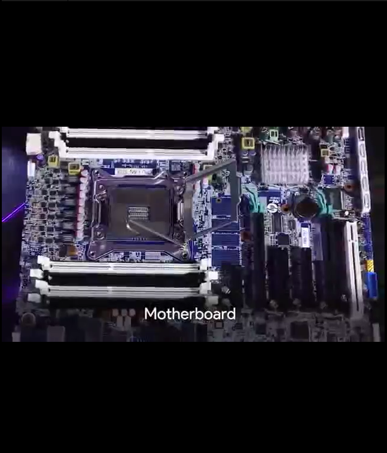

# introduction to IT
## Course introduction
> **What is IT**: the use of digital technology, like computers and the Internet, to store and process data into useful information
>
> **What does an IT support specialist do?** managing installing maintaining troubleshooting configuring
## History
## Digital logic
>Computer language  
>
>Character Encoding: character encoding
>
>Binary logic gates: allow our transistors to do more complex tasks, like decide where to send electrical signals depending on logical conditions.
>
>How to count in binary
## Computer Architecture Layer
>Abstraction :To take a relatively complex system and simplify it for our use
>
>Computer Architecture overview: Hardware layer: Made up of the physical components of a computer.
>
>Operating system: allows hardware to communicate with the system 
>
>User: Interacts with the computer

# Hardware
## The morden computer 
>**Intro to computer Hardware**: ports connection points that we can connect devices to that extend the functionality of our computer.  **CPU(central processing unit)**:the brain of our computer, it does all the calculations and data processing.  **RAM(random Access Memory)**:our computer’s short-term memory  **Hard drive**:Holds all of our data, which includes all of our music, pictures, applications  **Motherboard**:the body or circulatory system of the computer that connects all the pieces together
>
>**Programs and Hardware  programs** :instructions that tell the computer what to do
>
>**speed**:the maximum number of clock cycles
## Components
>**CPU fuctions**:adding subtracting copying data  When you select your CPU, you’ll need to make sure it’s compatibale with your motherboard—the circuit board that connects all your components together.
>
>**RAM**:there are lots of types of RAM,and one that’s commonly found in computers is DRAM,or dynamic random-access memory.  IN today’s system, we use another type of RAM, called double data rate SDRAM or DDR SDRAM for short.
>
>
> **Motherboards**:  **Peripherals**: External devices we connect to our computer, like a mouse, keyboard,and monitor  **Expansion slots**:Give us the ablility to increase the functionality of our computer. **Storage: HDD(HDD,SSD)**    **Power supplies**  **Peripherals**:anything that you connect to your computer externally that adds functionality 
## Operating system
>**What’s an operating system?**  operating system: the whole package that manages our computer’s resources and lets us interact with it. I/O management anything that can give us input, or that we can use for output of data.
>
>**Process Management Process**: A program that’s executing, like our internet browser or text editor.
>
>**Program**:An application that we can run, like Chrome  
>
>**Memory management** 
>
>**I/O management**
>
>**Logs logs**:files that record system events on our computer,just like a system's diary
>
>**The boot process BIOS**
## Install
>Virtual Machines

# Networking
## Basis of internet
>**ip**:computers on a network have an identifier called an IP address 
Networking Hardware   **router** :Connects lots of different devices together and help route network traffic     **Network stack**: A set of handware or software that provides the infrastructure for a computer
## Language of the internet
>**History of the Internet**
>
>**Limitations of the Internet**:Network address Translation(NAT)
>
>**Impact of internet  Globalization**:the movement that lets governments businesses, and organizations communicate and integrate together on an international scale
>
>**Internet of Thing**  
>
>**Privacy and Security**

# Software
## Types of software
>**Application software** Any software created to fulfill a specific need, like a text editor, web browser, or graphic editor. 
>
>**System software**: software used to keep our core system running,like operating system tools and utilities  
>
>**Firmware software** that’s permanently stored on a computer component 
## Recipe for Computing
>**Managing Software** : software bug: an error in software that causes unexpected results
>
>**Installing, updating, and removing software on windows**
>
>**Software Automation** 
>
>**Recipe for Computing**

# Troubleshooting
## troubleshooting best practices
>**ask question**: troubleshooting:The ability to diagnose and resolve a problem. IT support is about working in the service of others. Always try to create a positive experience for the user. 
>
>**Isolating the problem root cause**: the main factor that’s causing a range of issues  
>
>**Follow the cookie crumbs**   
>
>**Start witn the quickest step first**
>
>**Troubleshooting Pitfalls to avoid**


```python

```
