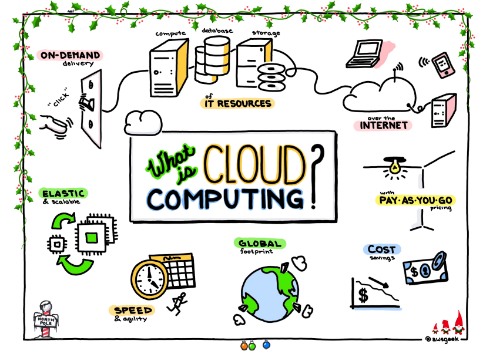

# What is cloud computing?
## Definition of cloud computing.
 Cloud computing is a resource delivery and usage model, it means get resource (Hardware, software)via network. The network of providing resource is called ‘Cloud’. The hardware resource in the ‘Cloud’ seems scalable infinitely and can be used whenever.
> For example, jack mike may want to have a picnic and barbecue. According to the traditional method, each of them brought a whole set of barbecue tools and ingredients. However, they were not happy, because each of them had to bring their own materials and cook their own barbecue. In the end, some people were left with extra materials, and some people still lacked materials. So when the three of them went to the barbecue in the second week, they chose another plan. Jack only brought the kitchen utensils for the barbecue, Mike was only responsible for putting the meet on iron sticks, and May was only responsible for bringing the ingredients such as chicken and beef and cooking them. In this way, not only can each of them eat meat according to their own needs, but they also be paid to make barbecues for other travelers after they have eaten enough. And this new method is cloud computing.

To summarize briefly, cloud computing is to centralize the computing resources in everyone's hands, put them in one place for unified management, and then dynamically allocate them to everyone. This computing resource includes hardware such as CPU, memory, hard disk, and software.


## IaaS PaaS SaaS
These are the three most common service models of cloud computing
### IaaS: Infrastructure-as-a-Service 
>IaaS is to provide hardware-related services. In the past, I wanted to build a website and build an FTP, and I have to buy hardware devices such as servers and switches by myself. Now I don’t need to use the IaaS service provided by IaaS service providers.
In the last story, Jack, who was responsible for bringing barbecue tools, can actually be regarded as an Iaas service provider.
### PaaS: Platform-as-a-Service
>PaaS service providers provide various solutions for developing and distributing applications, such as virtual servers and operating systems, and database systems. In the story, Jack and Mike, who is in charge of the iron sign and sauce, can be regarded as a PaaS service provider.
### SaaS: Software-as-a-Service
>This layer is the one that comes into contact with my life every day. On this layer, you can directly access and use service functions! For example, send and receive e-mails through a web browser, order goods, and check flight information.  Jack mike and may’s barbecue booth can be regarded as a SaaS.

## What are public clouds, private clouds and hybrid clouds?
### Public cloud 
Public cloud is not privately owned to provide services to the public. The advantages are low cost and good scalability. The disadvantage is that the data security is poor and the requirements for the network are higher.
#### Private Cloud
Private cloud is a cloud host built for users to use alone. It is an extension and optimization of a company's traditional data center. It can provide storage capacity and processing capabilities for various functions.
### Hybrid cloud
Through the public cloud, users can put sensitive data or run critical workloads on the private cloud, while general work or work that needs to be expanded on the public cloud, to keep the security and save money.


```python

```
